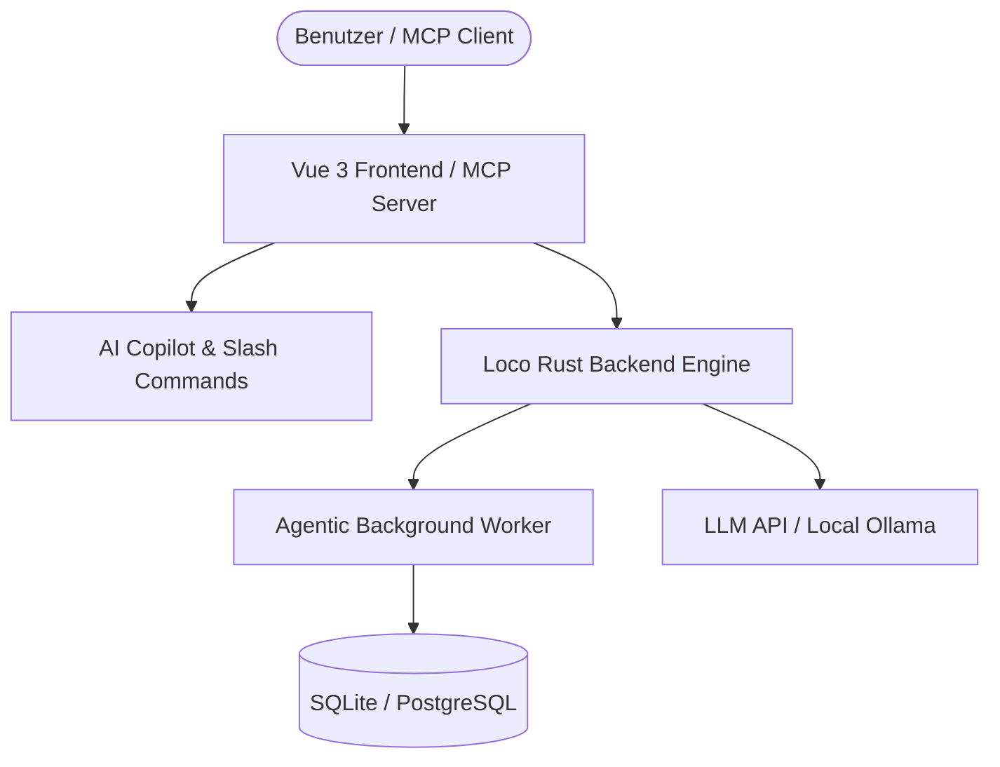

# AI-Native Todo & Project Management: System-Roadmap

Dieses Dokument beschreibt die Vision, Architektur und den konkreten Umsetzungsplan, um dieses Loco (Rust) + Vue 3 Projekt zu einem marktreifen **AI-Native Tool** auszubauen.

---

## 1. WAS (Features & Funktionen)

> [!NOTE]
> Ziel ist nicht nur ein einfacher Chatbot, sondern ein **agentisches System**, das Aufgaben versteht, zerlegt, automatisch zuweist und sich nahtlos in Arbeitsabläufe integriert.

### A. In-App AI Assistenz (Frontend & UI Integration)
* **Sidebar Copilot Drawer**: Ein interaktiver AI Chat in [App.vue](file:///home/trai/shares/cloud/Workspace/Rust/loco/todo/frontend/src/App.vue) mit Zugriff auf alle Projektkontexte.
* **Editor Slash Commands**: Befehle im [TiptapEditor.vue](file:///home/trai/shares/cloud/Workspace/Rust/loco/todo/frontend/src/components/editor/TiptapEditor.vue) wie `/ai summarize`, `/ai action-items` oder `/ai break-down`.
* **Automatischer Task-Breakdown**: Zerlegung komplexer Vorhaben in Unteraufgaben inklusive geschätzter Bearbeitungszeiten.

### B. Autonome Hintergrund-Agenten (Background Workflows)
* **Smart Auto-Triage**: Automatische Kategorisierung, Verschlagwortung (Tags) und Priorisierung neu erstellter Todos.
* **Standup & Progress Digests**: Täglich generierte Zusammenfassungen von erledigten Tasks und Blockaden via E-Mail ([AuthMailer](file:///home/trai/shares/cloud/Workspace/Rust/loco/todo/src/mailers/auth.rs)) oder Webhooks.
* **Intelligentes Zeit-Tracking**: Vorschläge für realistischere Aufwandsschätzungen basierend auf historischen Daten aus `time_entries` ([actions.rs](file:///home/trai/shares/cloud/Workspace/Rust/loco/todo/src/controllers/mcp/actions.rs#L10)).

### C. Erweiterte MCP (Model Context Protocol) Anbindung
* **Bidirektionales MCP**: Neben der Bereitstellung von MCP-Endpunkten ([mcp/mod.rs](file:///home/trai/shares/cloud/Workspace/Rust/loco/todo/src/controllers/mcp/mod.rs)) lernt das System, externe MCP-Tools (GitHub, Jira, Google Calendar) einzubinden.

---

## 2. WIESO (Nutzen & Mehrwert)

### 🚀 Warum ein AI-Native System?
1. **Automatisierung von Overhead**: Reduziert manuelle Sortier-, Tagging- und Planungsarbeiten um bis zu 80%.
2. **Nahtlose Kontextverbindungs**: Durch das [MCP Protocol](file:///home/trai/shares/cloud/Workspace/Rust/loco/todo/src/controllers/mcp/mod.rs) können externe KI-Tools (Cursor, Claude Desktop, Antigravity) direkt auf Projektdaten zugreifen.
3. **Rust-Performance & Effizienz**: Extrem geringer Speicherverbrauch und hohe Performance des Loco-Backends im Vergleich zu Python/Node.js-Lösungen.
4. **Datensouveränität**: Unterstützung lokaler Modelle (z.B. Ollama) schützt sensible Unternehmensdaten.

---

## 3. WIE (Architektur & Production Readiness)

### A. Technische Architektur im Backend (Loco / Rust)

1. **LLM Anbindung**:
   * Einbindung von Crates wie `rig-core` oder `async-openai` in [Cargo.toml](file:///home/trai/shares/cloud/Workspace/Rust/loco/todo/Cargo.toml).
   * Abstraktionsschicht für einfache Provider-Wechsel (OpenAI, Anthropic Claude, Ollama).

2. **Streaming & Asynchrone Jobs**:
   * Server-Sent Events (SSE) oder bestehende WebSockets ([ws.rs](file:///home/trai/shares/cloud/Workspace/Rust/loco/todo/src/controllers/ws.rs)) für Echtzeit-Streaming von KI-Antworten.
   * Nutzung der Loco Async Workers (`BackgroundAsync` in [development.yaml](file:///home/trai/shares/cloud/Workspace/Rust/loco/todo/config/development.yaml#L50)) für aufwendige KI-Aufgaben im Hintergrund.

---

### B. Production Readiness Checkliste

> [!IMPORTANT]
> Folgende Maßnahmen sind erforderlich, bevor das System produktiv betrieben werden kann:

#### 🔒 1. Sicherheit & Authentifizierung
- [ ] **OAuth2 + PKCE**: Umsetzung des [OAUTH_PLAN.md](file:///home/trai/shares/cloud/Workspace/Rust/loco/todo/OAUTH_PLAN.md) zur sicheren Autorisierung von MCP-Clients.
- [ ] **Granulare Scopes**: Einführung von Berechtigungsstufen (`mcp:read`, `mcp:write`, `ai:execute`).
- [ ] **Data Consent**: Ausbau der Projekt-Einstellungen (`mcp_expose_comments` in [actions.rs:350](file:///home/trai/shares/cloud/Workspace/Rust/loco/todo/src/controllers/mcp/actions.rs#L350)) auf granulare Freigaben.

#### ⚡ 2. Rate Limiting & Kostenkontrolle
- [ ] **Token Bucket Rate Limiter**: Verhinderung von API-Kostenexplosionen und DDoS-Angriffen per IP/User.
- [ ] **Quota Management**: Monatliches Token-Limit pro Benutzer/Account.

#### 🛡️ 3. Resilienz & Fallbacks
- [ ] **Model Redundancy**: Automatischer Fallback bei Ausfall primärer LLMs (z.B. Wechsel von Claude 3.5 auf GPT-4o-mini).
- [ ] **Tracing & Metrics**: Einbindung von OpenTelemetry/LangSmith für Kosten- und Latenz-Monitoring.

#### 🏢 4. Infrastruktur & Multi-Tenancy
- [ ] **PostgreSQL Migration**: Wechsel von SQLite zu PostgreSQL für hochverfügbaren Multi-Tenant-Betrieb in [compose.yml](file:///home/trai/shares/cloud/Workspace/Rust/loco/todo/compose.yml).
- [ ] **DSGVO / Local LLM Option**: Umschalter für Self-Hosted Umgebungen mit lokalen Modell-Endpoints.
